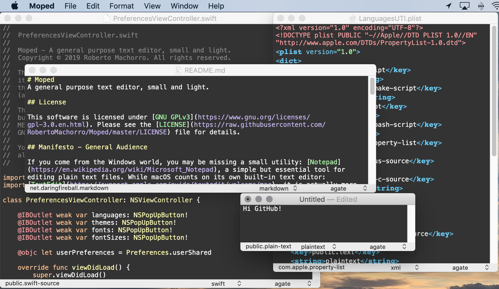

## License

This FREE software is licensed under [GNU GPLv3 or later](https://www.gnu.org/licenses/gpl-3.0.en.html). Please see the [LICENSE](https://raw.githubusercontent.com/RobertoMachorro/Moped/master/LICENSE) file for details.

## Download Binary App

Pre-compiled versions are available directly from [GitHub](https://github.com/RobertoMachorro/Moped/releases) or the [AppStore](https://apps.apple.com/us/app/moped-text-editor/id1477419086?mt=12).

## Manifesto - General Audience

If you come from the Windows world, you may be missing a small utility: [Notepad](https://en.wikipedia.org/wiki/Microsoft_Notepad), a simple but essential tool for editing plain text files. While macOS counts on its own built-in text editor: [TextEdit](https://support.apple.com/guide/textedit/welcome/mac), it is actually more like a *Rich Text Editor* with full images, fonts and layout support. Similar to the built-in [Windows Write](https://en.wikipedia.org/wiki/Microsoft_Write) or [WordPad](https://en.wikipedia.org/wiki/WordPad).

It kind of feels heavier than it should and in the way. There are [known settings](https://www.techjunkie.com/textedit-plain-text-mode/) to make it look and feel lighter, but inside it's still the same. You can [get the source](https://developer.apple.com/library/archive/samplecode/TextEdit/Introduction/Intro.html) and peek inside. It's bigger and with older code than it needs to be.

*Moped* intends on feeling like Notepad, while being a full native of macOS, with a touch of modern syntax highlight and themes.

## Manifesto - Advanced Users

While you can install the best text editors on your macOS system ([BBEdit](https://www.barebones.com/products/bbedit), [TextMate](https://macromates.com), [VIM](https://www.vim.org), [Emacs](http://www.gnu.org/software/emacs/), etc) - big and powerful, sometimes, you need just a small and light editor for that one file or note that you need to work on. It has to be light on resources and get out of the way.

*Moped* intends on getting the job done, with all the basics and standard macOS-like keyboard shortcuts.

## Manifesto - Developers

General developer audience has been loosing interest in macOS development and gained interest in [iOS cross platform development like Apple Marzipan](https://techcrunch.com/2018/06/04/apple-is-bringing-the-best-of-ios-to-macos/). Yet, macOS has gotten more powerful and feature rich, which makes it still an enticing platform to develop on. The big problem is that documentation, tutorials and QA/Forums materials are getting stale, with older API that no longer applies, it's getting harder as a developer to find up-to-date macOS support.

Most of the technology used in this App comes straight from Apple, we are just re-using the built-in stuff in a smart, clean way. If you scroll through the commit history, you'll (hopefully) understand how it was all pieced together. Please check the *Resources* section here for references and links.

*Moped* intends to be a showcase application and reference of a Document-Based Application, built on Swift, newest Cocoa API and fully Storyboard based.

## Wanted Features

* Status bar with word/paragraph count, etc.
* Command line launcher tool, with support for waiting (usable as $EDITOR)
* [Comprehensive Help File](https://developer.apple.com/library/archive/documentation/Cocoa/Conceptual/OnlineHelp/Tasks/SpecifyHelpFile.html#//apple_ref/doc/uid/20000020)
* Native Syntax highlight, ideally supporting TextMate files - this could be a nice Framework for the community
* Line number column(s)
* Code folding support

## Contributing

Contributions are more than welcome! Please fork the master branch and pull request when ready. Observe formatting and common coding patterns in Swift, for ideological reasons *tabs will remain tabs, not spaces*. Please understand that not all changes will be integrated, in particular they must remain in the ideals of the project.

All Pull Requests are automatically evaluated using [Travis CI](https://travis-ci.org/RobertoMachorro/Moped), Codacy/PR Quality Review, Hound and [Codebeat](https://codebeat.co/projects/github-com-robertomachorro-moped-master).

## Resources

[Document-Based App Programming Guide for Mac](https://developer.apple.com/library/archive/documentation/DataManagement/Conceptual/DocBasedAppProgrammingGuideForOSX/Introduction/Introduction.html)
